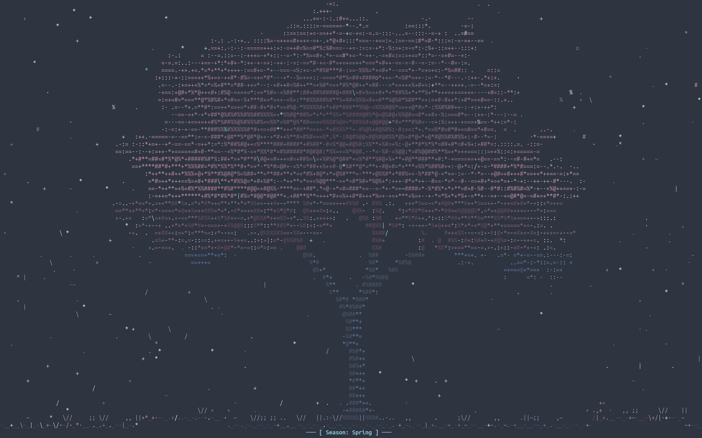
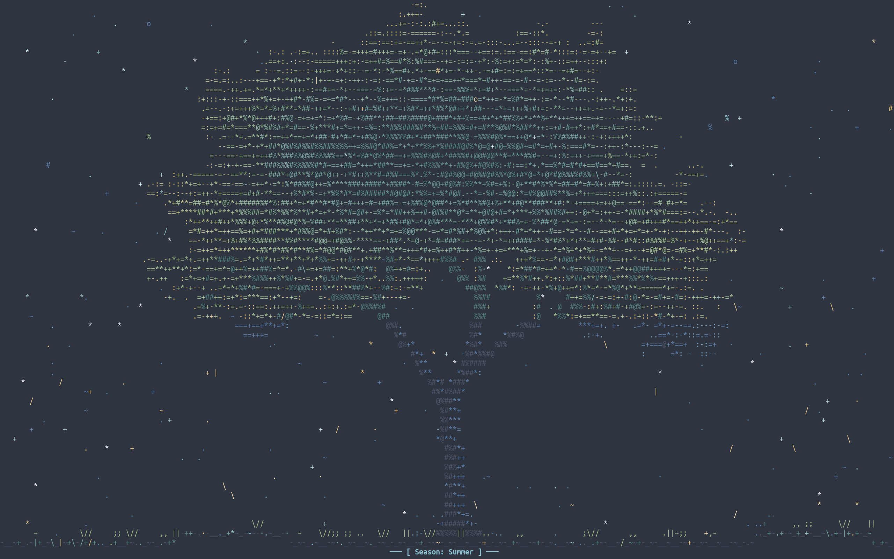
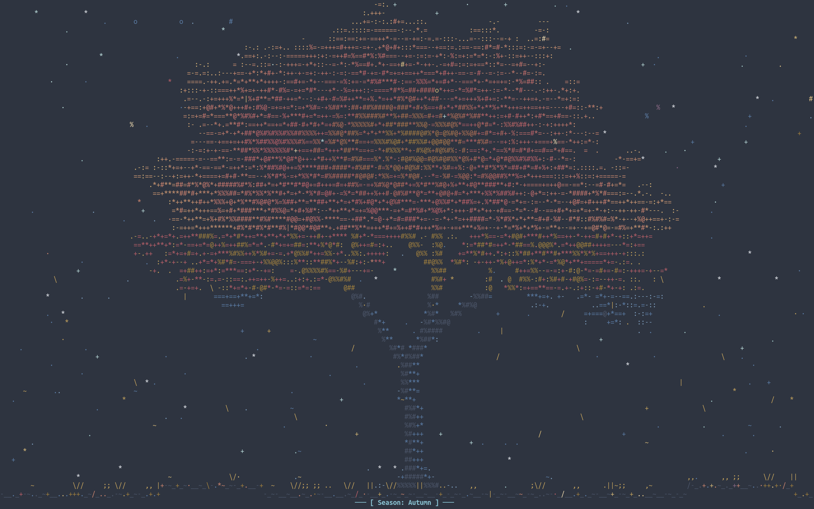
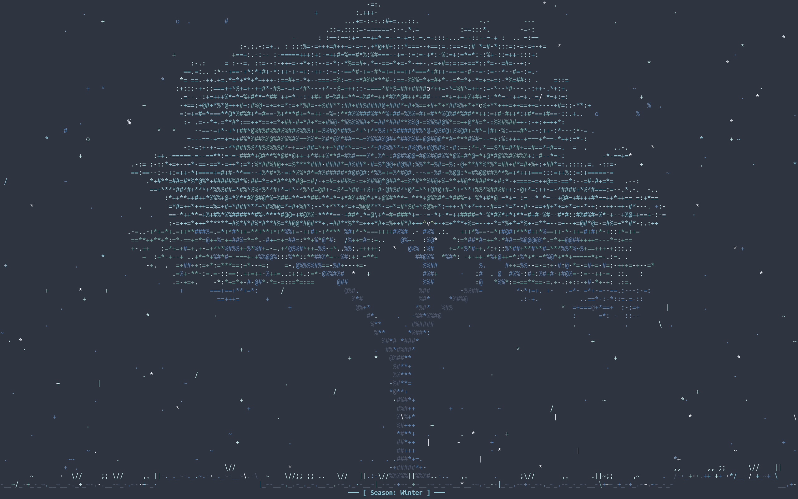
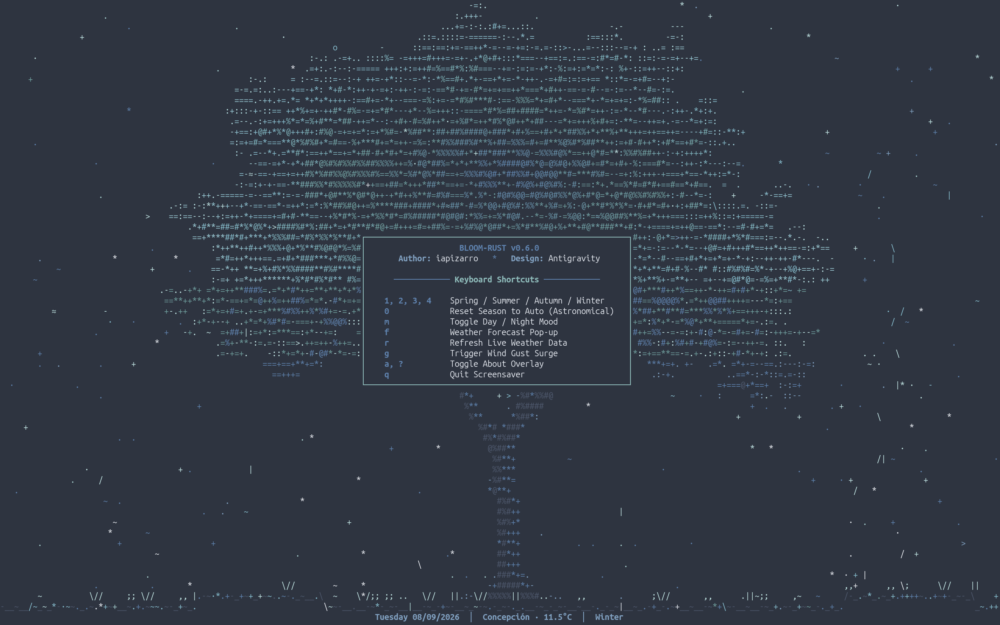
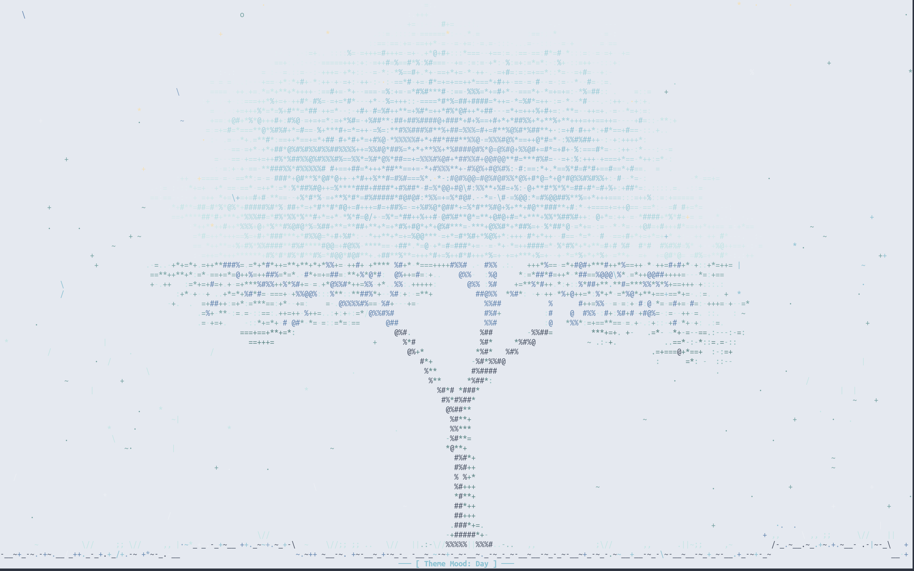
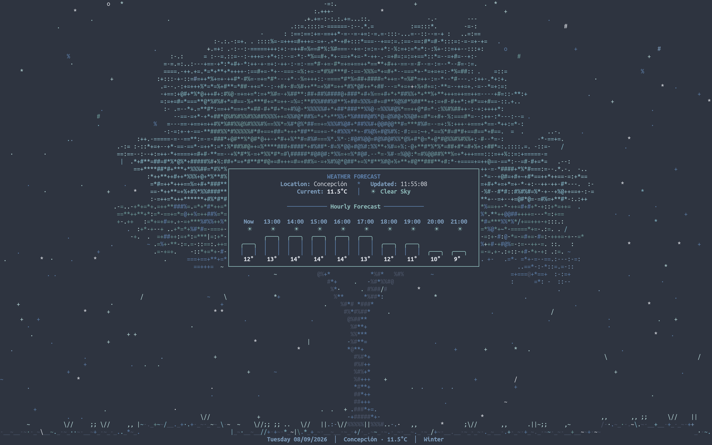

# bloom-rust

> Nord-themed Terminal Cherry Blossom Screensaver written in Rust.

## Overview
`bloom-rust` is an ASCII cherry blossom tree animation and terminal screensaver featuring organic canopy sway, leeward aerodynamic swirl vortices, 3D dual-layer parallax depth, rotational petal tumbling, organic terrain physics, dynamic altitude shading, real-time meteorological integration, and a pure Nord Polar Night aesthetic.

> **Inspiration**: This project was inspired by [nsakura](https://github.com/KornelHajto/nsakura) by Kornel Hajto.


- **Ambient Wildlife & Perching Birds**: Japanese White-Eye birds (`>•>`, `^v^`) that fly in, perch on branches with harmonic canopy sway, chirp, and take flight when startled by wind gusts (`g`).
- **Summer Night Fireflies (Hotaru)**: Luminescent fireflies (`✦`, `*`, `·`) drifting through the summer night air with soft breathing glow transitions between Nord Frost and Aurora Gold.
- **Floating Blossom Petals on Rain Puddles**: Petals landing on puddle water float and bob along ripple waves rather than settling into ground mounds.
- **Organic Canopy Sway & Branch Flutter**: The tree structure bends and flexes harmonically with ambient breezes and gusts, with outer blossom tips fluttering while the trunk remains firmly grounded.
- **Leeward Swirl Vortices & Branch Bouncing**: Canopy drafting creates localized aerodynamic vortices that curve falling petals in spiral arcs, while inner branch collisions deflect descending petals.
- **Dual-Layer Parallax Simulation**: Foreground and background petal planes drift independently around the canopy for authentic 3D spatial depth.
- **Aerodynamic Rotational Tumbling**: Petals rotate dynamically with angular momentum, transitioning between broadside and edge-on silhouettes as they drift.
- **Contoured Organic Ground & Petal Mounds**: Undulating terrain baseline with grass tufts, accumulating petal drifts, and gust-induced ground rustle.
- **Meteorological FX & Puddle Reflections**: Real-time environmental rain, cloud, snow, and fog with animated puddle reflections and water ripple dynamics.
- **Twinkling Starfield**: 5-tier Nord Frost twinkling star glow in night mode.
- **Seasonal Modes**: Spring blossom, Summer greens, Autumn amber, Winter frost, or Auto (auto-detects hemisphere via GNOME/system location).
- **Expanded 29-Color Nord Gradient Palette**: Multi-tier TrueColor gradients across Aurora, Amber Gold, Frost Teal/Cyan, Blossom Rose/Wisteria, Polar Night Slate, and Radiant Snow Storm for rich organic foliage, altitude descent shading, and dissolving petal mounds.
- **Fully Portable**: Pure-Rust TLS (`rustls`) -- no system OpenSSL or `pkg-config` needed.

## Screenshots

| Spring (Cherry Blossom) | Summer (Aurora Green & Warm Amber) |
| :---: | :---: |
|  |  |

| Autumn (Crimson & Gold) | Winter (Frost Cyan & Pure Snow) |
| :---: | :---: |
|  |  |

| Shortcuts & About Modal | Day Theme Mood |
| :---: | :---: |
|  |  |

| Weather Forecast Pop-up Modal |
| :---: |
|  |


## Prerequisites
- **Rust & Cargo**: Install via [rustup](https://rustup.rs/):
  ```bash
  curl https://sh.rustup.rs -sSf | sh
  ```
  No other system libraries are required.

## Installation
```bash
./install.sh
```
This compiles an optimized release binary and installs it to `~/.local/bin/bloom-rust` (and `~/.cargo/bin/bloom-rust`).

## Uninstallation
```bash
./install.sh --uninstall
```

## CLI Options
```
Usage: bloom-rust [OPTIONS]

Options:
  -s, --speed <SPEED>       Petal falling speed multiplier (0.1 - 10.0)
  -w, --sway <SWAY>         Wind sway amplitude multiplier
  -a, --art <FILE>          Custom ASCII art file path
      --stars               Enable twinkling starry background (default: on)
      --no-stars            Disable twinkling starry background
  -m, --mood <MOOD>         Theme mood: day | night (default: night)
      --season <SEASON>     Override season: spring | summer | autumn | winter | auto
      --hemisphere <HEMI>   Hemisphere: north | south | auto (default: auto)
      --no-weather          Disable real-time weather integration
      --city <CITY>         City for weather query
      --about               Show about page
  -h, --help                Print help
  -V, --version             Print version
```

## Controls
| Key | Action |
| :--- | :--- |
| `1` | Switch to **Spring** (Cherry Blossom Pink) |
| `2` | Switch to **Summer** (Aurora Green & Warm Amber) |
| `3` | Switch to **Autumn** (Aurora Crimson & Gold) |
| `4` | Switch to **Winter** (Frost Cyan & Pure Snow) |
| `0` / `` ` `` | Reset to **Auto Season** (Real-Time Astronomical) |
| `m` / `M` | Toggle **Day / Night** mood palette |
| `f` / `F` | Toggle **Weather & Forecast Pop-Up Modal** |
| `r` / `R` | Force **Live Weather Telemetry Refresh** |
| `g` / `G` | Trigger instant **Wind Gust Surge** |
| `a` / `?` | Toggle About & Shortcuts overlay |
| `q` | Quit screensaver |

## Bug Reports & Feedback
Found a bug, have a visual physics suggestion, or want to contribute?
- Open an issue on GitHub: [Issues Tracker](https://github.com/iapm2024/bloom-rust/issues)
- Pull requests and feedback are welcome!

## Acknowledgements
- [nsakura](https://github.com/KornelHajto/nsakura) by Kornel Hajto — for the original inspiration of an ASCII sakura blossom terminal animation.

## License
Licensed under [GNU General Public License v3](LICENSE).  
Author: iapizarro (iapm2024).


